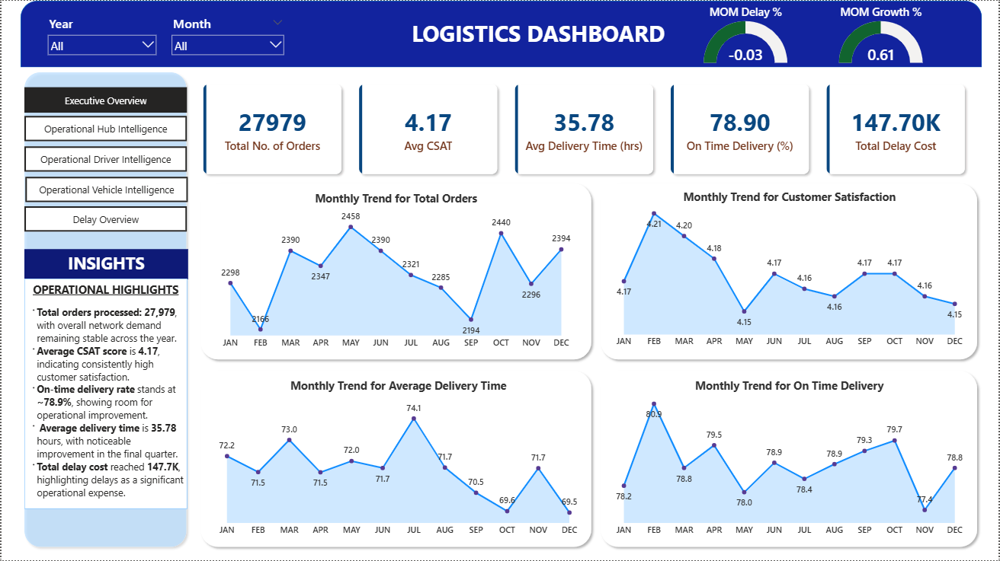

# 🚚 Delivery Network Performance & Risk Intelligence System

An end-to-end Business Intelligence project that analyzes logistics operations using SQL and Power BI to monitor delivery performance, detect operational bottlenecks, evaluate driver reliability, assess fleet risk, and quantify the financial impact of delays.

---

## Project Overview

SwiftRoute Logistics operates a multi-hub delivery network consisting of:

* 6 Operational Hubs
* 55 Active Drivers
* 45 Delivery Vehicles
* ~28,000 Historical Delivery Orders

In recent months, the company observed increasing delivery delays, rising vehicle breakdown incidents, uneven hub capacity utilization, and variability in driver performance.

This project builds an Operational Intelligence System that transforms raw delivery records into actionable insights using SQL-based analytics and Power BI dashboards.

The system helps identify:

* Operational bottlenecks
* Hub capacity stress
* Driver performance issues
* Vehicle reliability risks
* Financial impact of delivery delays

---

## Dashboard Preview

---

## System Architecture

The project follows a layered analytics architecture commonly used in modern business intelligence systems.

Operational Data --> SQL Data Model --> KPI & Intelligence Layer --> Power BI Dashboard

Data is first structured in relational tables, then transformed into analytical views using SQL, and finally visualized in Power BI.

---

## Data Model

The system uses a relational data model with the following entities:

Fact Table:

* Orders

Dimension Tables:

* Drivers
* Vehicles
* Hubs
* Date Dimension

This structure supports time-based analysis, KPI computation, and performance aggregation across the delivery network.

---

## Intelligence Modules

The analytics system is organized into five operational modules.

---

### Executive Operational Overview

Provides high-level operational KPIs including:

* Total Orders
* Average Delivery Time
* On-Time Delivery Rate
* Customer Satisfaction Score (CSAT)
* Total Delay Count
* Total Delay Cost

Trend analysis includes:

* Monthly order trends
* Monthly delivery time trends
* Monthly customer satisfaction trends

---

### Hub Performance Intelligence

Analyzes operational efficiency across delivery hubs.

Key metrics include:

* Orders processed per hub
* Hub utilization rate
* Hub stress level classification
* Average hub processing time
* Delay contribution by hub
* Hub delay risk ranking

Hub stress levels are categorized as:

* Underutilized
* Optimal
* High Load

---

### Driver Performance Intelligence

Evaluates driver efficiency and reliability across the delivery network.

Metrics include:

* Deliveries handled per driver
* Delay rate per driver
* Average delivery time per driver
* Customer satisfaction score
* Performance rating

A composite Driver Reliability Score is calculated using:

* On-time delivery percentage
* Customer satisfaction score
* Manager performance rating

Drivers are ranked based on reliability scores to identify top-performing and high-risk drivers.

---

### Fleet & Vehicle Risk Intelligence

Analyzes fleet performance and vehicle reliability.

Metrics include:

* Orders handled by vehicle model
* Breakdown frequency
* Maintenance frequency
* Vehicle age

A Vehicle Risk Score is computed based on:

* Vehicle age
* Breakdown frequency
* Maintenance frequency
* Operational delay impact

Vehicles are categorized into:

* Low Risk
* Medium Risk
* High Risk

---

### Delay & Financial Impact Analysis

Operational inefficiencies are translated into measurable financial impact.

Metrics include:

* Total delay cost
* Delay cost by hub
* Delay cost by driver
* Delay cost by vehicle model

A configurable penalty per delayed order is applied to estimate the operational cost of delivery delays.

---

## SQL Intelligence Layer

The SQL layer transforms raw operational data into analytics-ready datasets.

Key analytical views include:

Monthly Performance

* vw_monthly_operational_base
* vw_monthly_kpis
* vw_monthly_kpis_with_mom

Hub Intelligence

* vw_hub_performance_base
* vw_hub_performance_intelligence

Driver Intelligence

* vw_driver_performance_base
* vw_driver_performance_intelligence

Vehicle Intelligence

* vw_vehicle_performance_base
* vw_vehicle_risk_classification

Financial Impact

* vw_delay_financial_impact_network
* vw_delay_cost_by_hub
* vw_delay_cost_by_driver
* vw_delay_cost_by_vehicle

Executive KPI Dataset

* vw_executive_kpis

These views act as the semantic layer feeding the Power BI dashboard.

---

## Dashboard Modules

The Power BI dashboard contains five operational analysis modules:

1. Executive Overview
2. Hub Intelligence
3. Driver Performance
4. Fleet Risk Analysis
5. Delay Cost Analysis

These dashboards allow stakeholders to monitor delivery performance, identify operational risks, and track performance trends across the logistics network.

---

## Key Insights

* Dallas Main Hub processes the highest number of orders across the network, indicating heavy workload concentration.
* Austin Hub shows the highest delay risk among hubs.
* Average delivery time across the network is approximately 35–36 hours.
* On-time delivery rate is around 78–79%, indicating opportunities for operational improvement.
* Older vehicles show higher breakdown frequency, increasing fleet risk.
* Delivery delays generate measurable operational costs across hubs and drivers.

---

## Tools & Technologies

* SQL – Data modeling, KPI calculations, intelligence views
* Power BI – Dashboard visualization and reporting
* Excel – Data preparation
* Relational Data Modeling

---

## Skills Demonstrated

* SQL Data Modeling
* KPI Engineering
* Operational Analytics
* Business Intelligence Design
* Risk Scoring & Ranking
* Financial Impact Analysis
* Power BI Dashboard Development
* Data Storytelling

---

## Business Value

This system enables logistics management teams to:

* Detect operational bottlenecks
* Monitor delivery performance
* Identify unreliable drivers
* Detect high-risk fleet vehicles
* Quantify the financial impact of delays

These insights support better operational planning, resource allocation, and delivery network optimization.
